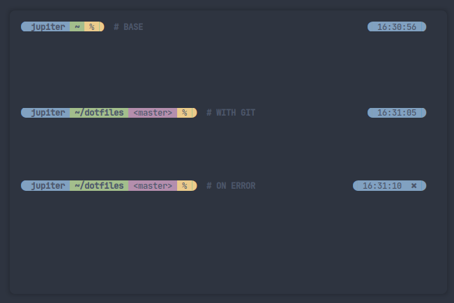

# Nautilor Oh My Zsh Prompt

This is my customized Prompt to use with [Oh My Zsh](https://github.com/ohmyzsh/ohmyzsh)

# Screenshot




# Installation

clone the repository

```bash
git clone https://github.com/nautilor/nautilor-zsh-prompt
cd nautilor-zsh-prompt
```

copy the prompt to the themes folder

```bash
cp prompt/nautilor.zsh-theme ~/.oh-my-zsh/themes/
```

configure change your `.zshrc` theme

```bash
ZSH_THEME="nautilor"
```